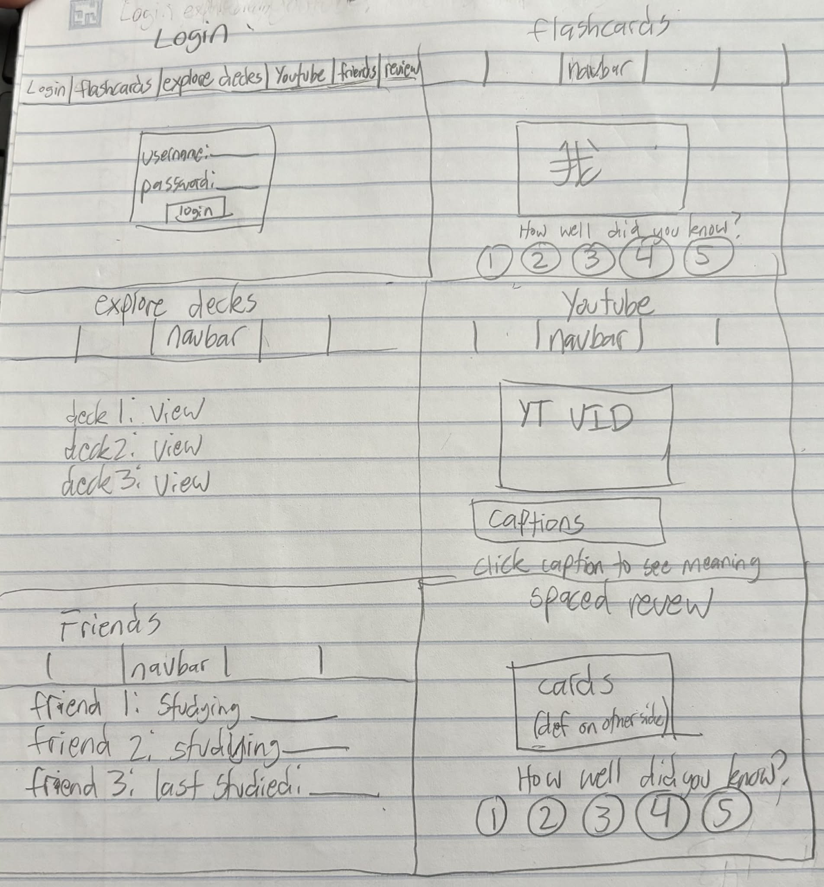
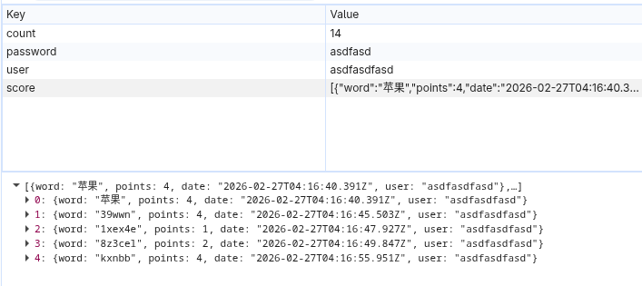

# LangLearn

[My Notes](notes.md)

A language learning app that gives control back to you. For free.

## 🚀 Specification Deliverable

For this deliverable I did the following. I checked the box `[x]` and added a description for things I completed.

- [x] Proper use of Markdown
- [x] A concise and compelling elevator pitch
- [X] Description of key features
- [X] Description of how you will use each technology
- [x] One or more rough sketches of your application. Images must be embedded in this file using Markdown image references.

### Elevator pitch

Learning a new language can be expensive. There are so many platforms that all want you to pay a monthly subscription fee, just to offer a service that could create myself. LangLearn allows you to study flashcards, watch youtube videos, and more, while secretly remembering the words you have learned in the background. It also provides a spaced review option that allows you to practice words you espeically want to learn.

### Design



Login Page: Access your account
Friends Page: See what your friends are/were studying.
Flashcards Page: Study a predefined deck of flashcards.
Spaced Review Page: Study the flashcards that you don't know as well. (auto-generated)
Youtube Page: Watch youtube videos with the captions below. You can click on captions to see a definition.
Explore Decks Page: Allows you to find decks created/used by other users.


### Key features

- Study YouTube or Flashcard decks, while the program finds out what words you don't know as well.
- Spaced Reptition uses the SM-2 algorithm to find out what flashcards need to be studied the most. This allows you to review the words right when you might forget them.
- See what your friends are studying!

### Technologies

I am going to use the required technologies in the following ways.

- **HTML** - HTML will structure all pages of the website. I will have an HTML page for Login, Flashcards, Explore, YouTube, Friends, and Spaced Review.
- **CSS** - Will make the website look nice! I will also implement a card flipping animation.
- **React** - This will manage the application state. One place I will use React is for the flashcards page. React will keep track of what flashcard I am on as I flip through all of them!
- **Service** - Backend endpoints will be serving the customers custom flashcard decks, spaced review decks, and YouTube video metadata.
- **DB/Login** - I will have a Database to keep track of each users learned words, as well as each flashcard deck. There will be a login page that allows users to authenticate so that they can make changes to the database.
- **WebSocket** - I will use WebSockets on the Friend page. I will set it up so that the user will see real time updates on what their friends are studying.

## 🚀 AWS deliverable

For this deliverable I did the following. I checked the box `[x]` and added a description for things I completed.

- [x] **Server deployed and accessible with custom domain name** - [My server link](https://claytonstallings.com).

[Description can be found here](notes.md#aws)


## 🚀 HTML deliverable

For this deliverable I did the following. I checked the box `[x]` and added a description for things I completed.

- [x] **HTML pages** - created 4 html pages. index.html, friends.html, browse.html, and study.html.
- [x] **Proper HTML element usage** - I spent a lot of time learning about HTML. I used header, footer, main, nav, a, button, form, and more.
- [x] **Links** - The header contains links to all pages.
- [x] **Text** - All pages have text
- [x] **3rd party API placeholder** - The study.html page contains a time at the botton. I will query a 3rd party API that gets EXACT time.
- [x] **Images** - LangLearn photo is beneath the log on. this is at index.html.
- [x] **Login placeholder** - located at index.html
- [x] **DB data placeholder** - DB will store the card deck information. Card data is the db data. See the place holder at study.html.
- [x] **WebSocket placeholder** - The friends.html page contains friend info. This will be updated live with what the friends are currently studying, or when they were last online. This currently has websocket placeholder info in it.


## 🚀 CSS deliverable

For this deliverable I did the following. I checked the box `[x]` and added a description for things I completed.

- [x] **Visually appealing colors and layout. No overflowing elements.** - Simple colors and simple layout. Nothing overflows.
- [x] **Use of a CSS framework** - I used CSS on all my webpages!
- [x] **All visual elements styled using CSS** - Everything is styled with CSS! That means all the backgrounds and navbar. The text also is centered and styled using CSS.
- [x] **Responsive to window resizing using flexbox and/or grid display** - The 'main' and 'footer' part of my code has flexbox being used
- [x] **Use of a imported font** - using roboto. Can be seen in my CSS!
- [x] **Use of different types of selectors including element, class, ID, and pseudo selectors** - I am using all those forms of selectors in my main.css file!

## 🚀 React part 1: Routing deliverable

For this deliverable I did the following. I checked the box `[x]` and added a description for things I completed.

- [x] **Bundled using Vite** - Vite builds the app for development and production (npm run dev, and npm run build)
- [x] **Components** -  I split each page into its own React component (Login, Friends, Browse, Study)
- [x] **Router** - I used React Router to navigate between pages without full reloads.

## 🚀 React part 2: Reactivity deliverable

For this deliverable I did the following. I checked the box `[x]` and added a description for things I completed.

- [x] **All functionality implemented or mocked out** - Created the login feature. Currently the login info is stored in local storage. Once I get the DB running, a register button will create a user if it doesnt exist with associated password. Login will only work if password is correct. Currently, the local storage just stores whatever user typed in, and it always works. Will add actual authentication on database stage. 
I also got the score local storage working so that it will be easily incorporated with a database. This app looks a little boring, but will become powerful once a database has been hooked up. This way I can pull decks from the database, and do spaced reviews based on what the user needs most. The logic is all built in now through.

I also set the friends to be in local storage. This is because each user might have a different number of friends. As a result, the React page needs to be able to display the correct variable amount, and randomly display a status for each. To do this I used the same system of storing a json file in local storage. I set the website to default having 6 friends for demo purposes. the randomization works by having a useState react hook that is updated on interval within useEffect hook. In the beginning, it sets all the friends to have an offline state, and then every 5 seconds one of them will be randomly updated to something new in the list of possible actions.
- [x] **Hooks** - using react useState a LOT and also using useEffect. useState is used for user login information, friend statuses, and deck scoring. useEffect is used to update friend status on an interval.
## 🚀 Service deliverable

For this deliverable I did the following. I checked the box `[x]` and added a description for things I completed.

ALSO - I made it so users can upload their own decks. For an example of what to upload, you can either upload the 'test.json' file that is in my repo. or you can just create this json file on your own machine and upload it:
```
{
  "name": "Spanish Basics",
  "cards": [
    { "question": "hola", "answer": "hello" },
    { "question": "gracias", "answer": "thank you" }
  ]
}
```

- [x] **Node.js/Express HTTP service** - Built a backend service and ran it locally on port 4000. You can see this at service/index.js
- [x] **Static middleware for frontend** - Uses express built-in json body parsing middleware. Also uses static hosting middleware! These are found in servie/index.js. there are also comments that highlight where they are.
- [x] **Calls to third party endpoints** - This wasn't super necessary for the app I built, but to check the box, I made the study page fetch UTC time from WorldTimeAPI and shows study start time. You can see this right in the study page of the website, or in the code in the study.jsx file.
- [x] **Backend service endpoints** - Added tons of these. You can see the tests for them in notes.md. Or just open index.js. I use backend services to manage the logging in, logging out, registering, creating decks, listing decks, and score history.
- [x] **Frontend calls service endpoints** - Again, I added a ton of these. Not hard to find. I commented in login.jsx highlighting just one of them, the fetch that logs in the user.
- [x] **Supports registration, login, logout, and restricted endpoint** - service/index.js has this all over. I added a comment over the create user that uses bcrypt to has the password. I also have the endpoints for /api/auth/login /api/auth/logout and /api/auth/create. Restricted endpoint example would be /api/scores. This requires you to pass through the verifyAuth function before doing anything. Unauthenticated users cannot use this.


## 🚀 DB deliverable

For this deliverable I did the following. I checked the box `[x]` and added a description for things I completed.

Also, this is a message for Weston in case you are reading this... Sorry that on the last deliverable my API call wasnt working. It looked like it was from the frontend, because the time was showing, but I had competely forgot that I put the time thing in a try/catch loop and had the catch just manually calculate the computer time if the API call failed (which was what was happening). I was pretty annoyed with the time API being dumb and finnicky, so I just had it display the weather in the same place on the same page. Sorry about that confusion! It should be fixed now.

And here is all the DB stuff. It was a pretty smooth switch.

- [x] **Stores data in MongoDB** - I did this! User uploaded decks and user scores get stored into MongoDB. Yay!
- [x] **Stores credentials in MongoDB** - I did this! Users are stored in MongoDB along with their hashed passwords.

Here is a little sneakpeak into it working. :D


## 🚀 WebSocket deliverable

For this deliverable I did the following. I checked the box `[x]` and added a description for things I completed.

- [x] **Backend listens for WebSocket connection** - The backend uses the ws package to create a WebSocket server attached to the same HTTP server as Express. See all this handled in peerProxy.js
- [x] **Frontend makes WebSocket connection** - When a user logs in, app.jsx opens a WebSocket connection. 
- [x] **Data sent over WebSocket connection** - Status messages are sent over the websocket connection: `{ type: 'status', username, status }`. This happens automatically whenever the user navigates to a new page, this happens in the StatusReporter function in app.jsx
- [x] **WebSocket data displayed** - The Friends page displays the real-time status of each friend. See this change live at friends.jsx
- [x] **Application is fully functional** - Users can add friends by username, see their real-time page status update live without refreshing, and see them go Offline when they click the 'logout' button.

How to see the webhooks in action (for TAs)

1. Open two browser tabs and go to the app in both
2. Create two separate accounts (or log into two you already have), one per tab
3. In tab 1, go to the Friends page and type the username of tab 2's account, then click Add
4. Now navigate around in tab 2 (click Study, Browse, etc)
5. Watch tab 1's Friends page, it will update in real time showing what page tab 2 is on
6. Click the `Logout` button on tab 2, tab 1 will immediately show that friend as Offline

